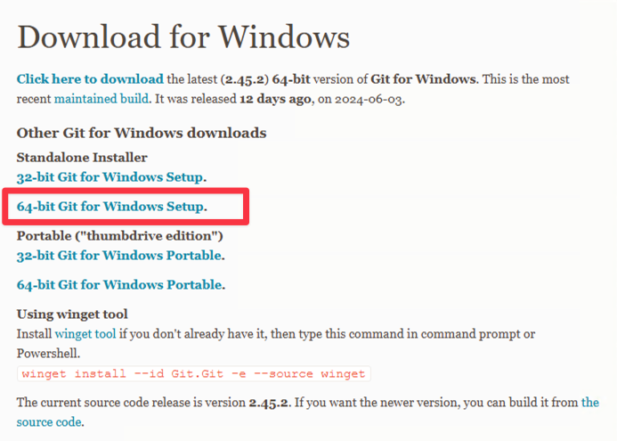

<style>
.custom {
    background-color: #008d8d;
    color: white;
    padding: 0.25em 0.5em 0.25em 0.5em;
    white-space: pre-wrap;       /* css-3 */
    white-space: -moz-pre-wrap;  /* Mozilla, since 1999 */
    white-space: -pre-wrap;      /* Opera 4-6 */
    white-space: -o-pre-wrap;    /* Opera 7 */
    word-wrap: break-word;
}

pre {
    background-color: #027c7c;
    padding-left: 0.5em;
}

</style>

# Getting Started on Windows

- Author: [Wooseok-Jeong](https://github.com/jeong-wooseok)
- Peer Review: [Yun Eun](https://github.com/yuneun92), [MinJi Kang](https://www.linkedin.com/in/minji-kang-995b32230/)
- This is a part of [LangChain Open Tutorial](https://github.com/LangChain-OpenTutorial/LangChain-OpenTutorial)

[](https://colab.research.google.com/github/LangChain-OpenTutorial/LangChain-OpenTutorial/blob/main/01-Basic/01-Getting-Started-Windows.ipynb) [](https://github.com/LangChain-OpenTutorial/LangChain-OpenTutorial/blob/main/01-Basic/01-Getting-Started-Windows.ipynb)

## Overview

This tutorial explains how to install the LangChain package on Windows environment. You can easily build a development environment by cloning the required github repository, batch installing the same packages as the author via pyenv, Poetry, installing Visual Studio Code and Jupyter Extension.

### Table of Contents

- [Overview](#overview)
- [Install git](#install-git)
- [Install pyenv](#install-pyenv)
- [Install Poetry](#install-poetry)
- [Install Visual Studio Code](#install-visual-studio-code)
- [Install Jupyter Extension](#install-jupyter-extension)

### References
- [Download git](https://git-scm.com/download/win)
- [Download Visual Studio Code](https://code.visualstudio.com/download)

----


## Install git
[Download git](https://git-scm.com/download/win)

Download 64-bit Git for Windows Setup




Confirm options during installation and proceed


Click the Next button for all the rest to proceed with the installation.


Window key - PowerShell must be run as administrator

Enter the command "`git`" and verify that the output looks like the image below
```Powershell
git
```


- Apply PowerShell Policy 

First, run **Windows PowerShell** as an "administrator."</p> <p><br>

Enter the following command to apply the policy
```Powershell
Set-ExecutionPolicy RemoteSigned -Scope CurrentUser -Force
```
After the application is complete, turn Windows PowerShell off and then on. For the purposes of the following, "Run as administrator" when running Windows PowerShell.

## Install pyenv
Install pyenv before installing python. pyenv installs a virtualization environment to prevent conflicts between packages.

```Powershell
git clone https://github.com/pyenv-win/pyenv-win.git "$env:USERPROFILE\.pyenv"
```

- Add environment variables

Copy and paste the content below and run it
```Powershell
[System.Environment]::SetEnvironmentVariable('PYENV', $env:USERPROFILE + "\.pyenv\pyenv-win\", "User")
[System.Environment]::SetEnvironmentVariable('PYENV_ROOT', $env:USERPROFILE + "\.pyenv\pyenv-win\", "User")
[System.Environment]::SetEnvironmentVariable('PYENV_HOME', $env:USERPROFILE + "\.pyenv\pyenv-win\", "User")
```

Copy and paste the content below and run it
```powershell
[System.Environment]::SetEnvironmentVariable('PATH', $env:USERPROFILE + "\.pyenv\pyenv-win\bin;" + $env:USERPROFILE + "\.pyenv\pyenv-win\shims;" + [System.Environment]::GetEnvironmentVariable('PATH', "User"), "User")
```

Shut down and rerun the current Windows PowerShell.

Enter the following command to verify that it works.
```powershell
pyenv
```
 


- Install python

Install Python version 3.11
```powershell
pyenv install 3.11
```
Setting 3.11 version of python as the default runtime
```powershell
pyenv global 3.11
```
Check your Python version
```powershell
python --version
```
Make sure you have version 3.11.9 installed (or 3.11.11 is fine too!).

## Install Poetry


Run the command below to install the Poetry package management tool.
```powershell
pip3 install poetry
```

(Note)

- Link to the lab code: https://github.com/LangChain-OpenTutorial/LangChain-OpenTutorial.git

Navigate to the Documents folder.

```powershell
cd ~/Documents
```

Execute the command below to get the source code.
```powershell
git clone https://github.com/LangChain-OpenTutorial/LangChain-OpenTutorial.git
```

Execute the command below to navigate to the LangChain-OpenTutorial directory.
```powershell
cd LangChain-OpenTutorial
```

Setting up a Python virtual environment
```powershell
poetry shell
```
Batch update Python packages
```powershell
poetry update
```

## Install Visual Studio Code


Download Visual Studio Code

- Download link: https://code.visualstudio.com/download

Install the downloaded Visual Studio Code (copy it to the Applications folder)

Click 'install' of Jupyter on left Menu of extensions 


## Install Jupyter Extension
Search for "python" and install


Search for "jupyter" and install


Turn off and restart Visual Studio Code

The installation is complete, and you can click the "select kernel" button in the top right corner.

Click python environment - if you don't see the virtual environment you installed, turn off Visual Studio Code and restart it
